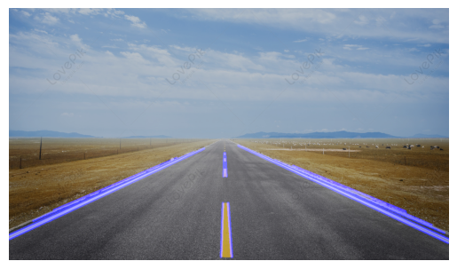
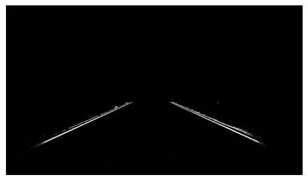

# IGVC_Task
Recruitment Task of the IGVC

## Question_1 

__Final Output__ : 

Move 0: (6, 1, 0, 0)
Move 1: (5, 1, 0, 0)
Move 2: (6, 1, 0, 0)
Move 3: (6, 2, 0, 1)
Move 4: (6, 1, 0, 1)
Move 5: (6, 1, 0, 2)
Move 6: (6, 1, 0, 3)
Move 7: (7, 1, 0, 0)
Move 8: (6, 1, 0, 0)
Move 9: (5, 1, 0, 0)
Move 10: (5, 2, 0, 1)
Move 11: (6, 1, 1, 1)
Move 12: (6, 2, 0, 1)
Move 13: (6, 3, 0, 1)
Move 14: (6, 2, 0, 1)
Move 15: (6, 1, 0, 1)
Move 16: (6, 1, 0, 2)
Move 17: (6, 2, 0, 3)
Move 18: (7, 2, 0, 0)
Move 19: (6, 2, 0, 0)
Move 20: (6, 1, 0, 1)
Move 21: (6, 1, 0, 2)
Move 22: (6, 1, 0, 3)
Move 23: (7, 1, 0, 0)
Move 24: (8, 1, 0, 0)
Move 25: (7, 1, 0, 0)
Move 26: (6, 1, 0, 0)
Move 27: (6, 1, 0, 1)
Move 28: (6, 1, 0, 2)
Move 29: (5, 1, 1, 3)
Move 30: (3, 1, 2, 3)
Move 31: (2, 1, 1, 3)
Move 32: (3, 1, 0, 0)
Move 33: (4, 2, 1, 0)
Move 34: (5, 2, 0, 0)
Move 35: (5, 3, 0, 1)
Move 36: (6, 2, 1, 1)
Move 37: (8, 2, 2, 1)
Move 38: (10, 1, 2, 1)
Move 39: (11, 1, 1, 1)
Move 40: (12, 1, 0, 2)
Move 41: (11, 2, 1, 3)
Move 42: (10, 3, 1, 3)
Move 43: (9, 3, 1, 3)
Move 44: (7, 3, 2, 3)
Move 45: (4, 3, 3, 3)
Move 46: (2, 2, 2, 3)
Move 47: (1, 1, 1, 3)
Move 48: (1, 2, 0, 3)
Move 49: (2, 3, 1, 0)
Move 50: (3, 3, 0, 0)
Move 51: (3, 2, 0, 1)
Move 52: (4, 2, 1, 1)
Move 53: (6, 2, 2, 1)
Move 54: (8, 3, 2, 1)
Move 55: (9, 2, 1, 1)
Move 56: (9, 1, 0, 1)
Move 57: (8, 1, 0, 2)
Move 58: (7, 1, 0, 2)
Move 59: (6, 1, 0, 2)
 
It is not fully correct. If we consider four quandrants of the lane, the robot is able to move only in one of the quadrants. I tried to fix this problem by considering a center of the map, and ensuring that it goes to atleast one box of each quadrant but it goes into inifnite interation when i do that. I am thinking on it...

## Question_2 : 

__Final Outputs__ : 

For the steps i have followed u can refer to jupyter notebook i have mentioned the techniques i have used to get the final outputs

